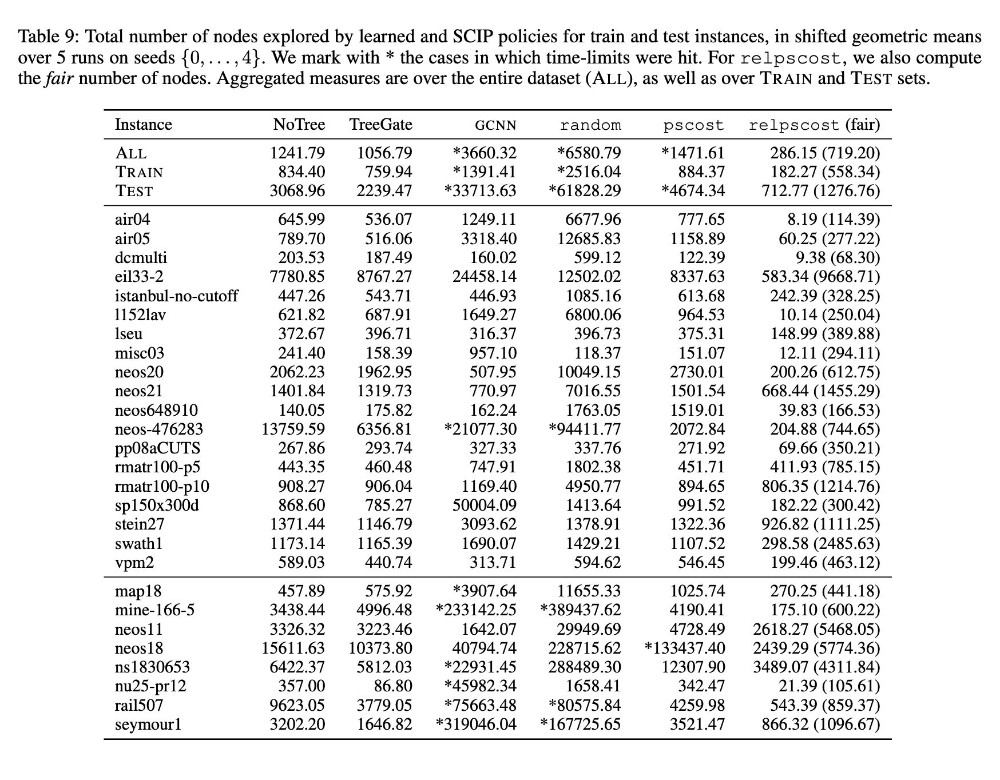

# Parameterizing Branch-and-Bound Search Trees to Learn Branching Policies

Giulia Zarpellon, Jason Jo, Andrea Lodi and Yoshua Bengio

---

This is the code for our paper ***Parameterizing Branch-and-Bound Search Trees to Learn Branching Policies***, accepted at AAAI 2021.

In this project, we
+ tackle the problem of _branching variable selection_ in Branch-and-Bound (B&B) for Mixed-Integer Linear Programming (MILP) problems;
+ seek to learn branching policies that _generalize across **heterogeneous MILPs**_, regardless of the instances’ structure and formulation size.

To achieve this broader generalization scope, we
+ develop parameterizations of the _candidate variables_ and of the _search trees_ (_C_<sub>t</sub>, _Tree_<sub>t</sub>), and 
+ design two DNN architectures (NoTree and TreeGate) that handle candidate sets of varying size.


Our results on MILP benchmark instances show that
+ incorporating a search-tree context to modulate branching aids generalization (with better test accuracy and smaller B&B trees);
+ the GCNN paradigm alone ([Gasse et al. 2019](https://arxiv.org/abs/1906.01629)) does not allow to generalize to new instances across different classes.

Here are our MILP evaluation results using the solver SCIP: 



Below we provide links and instructions to our paper, source code, dataset, trained models and supplementary materials (SM). 

---

## Paper and supplementary materials

* [AAAI-21 Official version](TO-BE-ADDED) - does not include SM. _The official published AAAI-21 version is not available yet._
* [arXiv version](https://arxiv.org/abs/2002.05120) - full version with SM. 

Until the official AAAI-21 version is published, please use the following BibTeX to cite our paper and/or dataset: 

```
@misc{zarpellon2020parameterizing,
      title={Parameterizing Branch-and-Bound Search Trees to Learn Branching Policies}, 
      author={Giulia Zarpellon and Jason Jo and Andrea Lodi and Yoshua Bengio},
      year={2020},
      eprint={2002.05120},
      archivePrefix={arXiv},
      primaryClass={cs.LG}
}
```

## Talks and presentations 

* June 4, 2020 - Presentation at the [SCIP Online Workshop 2020](https://scipopt.org/workshop2020/) by Giulia Zarpellon. 
[[Youtube video]](https://www.youtube.com/watch?v=9iIiA-wKZ2w) | [[Slides]](graphics/HO-SCIPWorkshop-GZarpellon.pdf).


## Installation and dependencies

We use [SCIP 6.0.1](https://scip.zib.de/index.php#download) and we use a customized version of PySCIPOpt, which we provide here:  
https://github.com/ds4dm/PySCIPOpt/tree/branch-search-trees.

Once SCIP 6.0.1 has been installed, our `branch-search-trees` customized version of PySCIPOpt can be installed via `pip`:

```
pip install git+https://github.com/ds4dm/PySCIPOpt.git@branch-search-trees
```

All other requirements are in `requirements.txt`.

## Dataset 

The `branch-search-trees` dataset is hosted at the Open Science Framework (OSF):  
https://osf.io/uvg5f/.

Our dataset consists of the following files:
* `train.h5`: a H5 file containing all the train data.
* `val.h5`: a H5 file containing all the validation data.
* `test.h5`: a H5 containing all the test data.
* `train_instances/`: a directory containing the 19 train MILP instances.
* `test_instances/`: a directory containing 8 test MILP instances.
* `cutoff_dict.pkl`: a pickle file containing all the cutoff values for the instances.
* `instance_dict.pkl`: a pickle file containing the names of instances and if they belong to the `train` or `test` split.

### How to create the dataset

We share how we produced the above dataset. 
Note that exact replication of our dataset collection may be dependent on the machine hardware. 
Nonetheless, we provide the code for transparency and in case others want to produce their own data.

#### Data collection from SCIP 

Specify system-specific paths in `collect.py`:
```
paths = {
    'MYSYSTEM': {
        'out_dir': '',          # path to output directory
        'instances_dir': '',    # path to MILP instances
        'cutoff_dict': '',      # path to pickled dictionary containing cutoff values
    },
}
```
Data collection runs instance-wise, as:
```buildoutcfg
python collect.py -n INSTANCE_NAME \
                  -s SCIP_SEED \
                  -k K_RANDOM_PAR \
                  --setting SCIP_SETTING \
                  --system MYSYSTEM \
                  -v
```
Note that `INSTANCE_NAME` contains file extension, but not path to files (e.g., `air05.mps.gz`). 
All MILP instances should be contained in `paths['MYSYSTEM']['instances_dir]`.
For each roll-out a pickle file is saved in `paths['MYSYSTEM']['out_dir]`.

#### HDF5 creation

Once we have all the SCIP collect files, we use `utilities/convert_multi_instance_pickle_to_hdf5.py` to convert all 
the collect pickle files into a single H5 file. We refer to the main paper for the exact train/val/test split and leave 
to the user to partition the collected files in the appropriate manner. 

#### Note on PySCIPOpt states

Our custom SCIP functions and input parameterizations are defined in `src/pyscipopt/scip.pyx` of the PySCIPOpt branch `branch-search-trees` 
(see link above).  
In particular, the parameterization of the search tree _Tree_<sub>t</sub> is given by concatenation of 
`getNodeState` and `getMIPState`, while the candidate variables representation _C_<sub>t</sub> is defined in `getCandsState`.

## Experiments

### Imitation Learning (IL)

To train a policy using our optimization settings:
```buildoutcfg

python train_test_IL.py  --policy_type POLICY_TYPE \
                         --hidden_size HIDDEN \
                         --depth DEPTH \
                         --train_h5_path PATH_TO_TRAIN_H5 \
                         --val_h5_path PATH_TO_VAL_H5 \
                         --test_h5_path PATH_TO_TEST_H5 \
                         --out_dir OUT_DIR_PATH \
                         --use_gpu \
                         --lr LR
```

For the `NoTree` policies, depth is not a relevant hyper-parameter, so you can use `DEPTH=1`. 

To evaluate a trained policy:
```buildoutcfg

python evaluate_IL.py --checkpoint PATH_TO_PYTORCH_CHECKPOINT \
                      --cutoff_dict PATH_TO_CUTOFF_DICT \
                      --instances_dir PATH_TO_RELEVANT_INSTANCE_DIR \
                      --out_dir PATH_TO_SAVE_SCIP_EVAL_DATA \
                      --name INSTANCE_NAME \
                      --seed SCIP_SEED
```

In the `trained-models/` directory we provide the trained `NoTree` and `TreeGate` models and their SCIP evaluations from our paper.  
Best parameters and results from the GCNN models obtained by running the code of [Gasse at al.](https://github.com/ds4dm/learn2branch) are also included.

### SCIP evaluations

Similarly to what is done in data collection, specify system-specific paths in `evaluate_SCIP.py`:
```
paths = {
    'MYSYSTEM': {
        'out_dir': '',          # path to output directory
        'instances_dir': '',    # path to MILP instances
        'cutoff_dict': '',      # path to pickled dictionary containing cutoff values
    },
}
```
Then specify instance, seed, SCIP branching policy (e.g., `relpscost`, `pscost`, `random`) and settings as:
```buildoutcfg
python evaluate_SCIP.py -n INSTANCE_NAME \
                        -s SCIP_SEED \
                        -p SCIP_POLICY 
                        --setting SCIP_SETTING 
                        --system MYSTSTEM
```

## Questions?

Please feel free to submit a GitHub issue if you have any questions or find any bugs. 
We do not guarantee any support, but will do our best if we can help.
